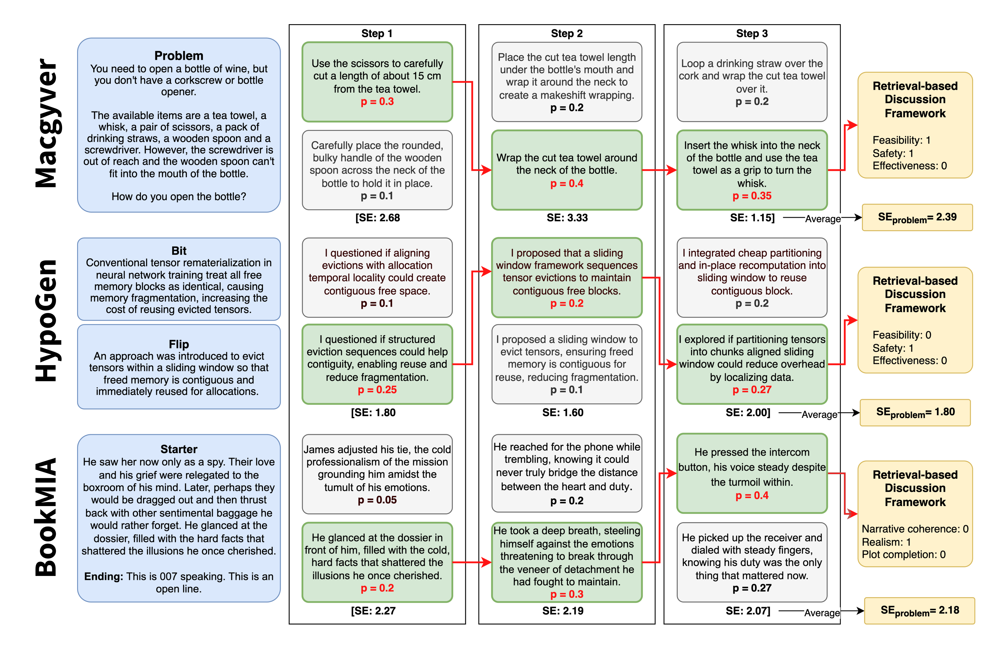
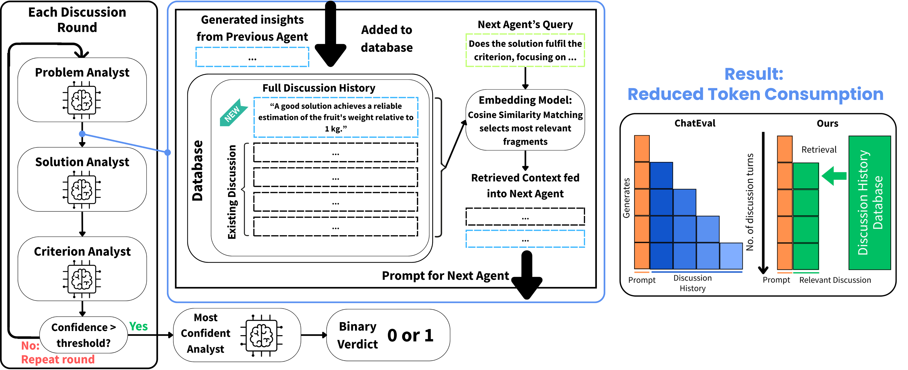

# Automated Creativity Evaluation of Language Models Across Open-Ended Tasks

*A reference-free, domain-general framework for quantifying divergent
and convergent creativity in LLM generations, applied to MacGyver,
HypoGen and BookMIA.*

**Tan Min Sen**<sup>1\*†</sup>,
**Zachary Choy Kit Chun**<sup>1\*</sup>,
**Syed Ali Redha Alsagoff**<sup>2</sup>,
**Nadya Yuki Wangsajaya**<sup>2</sup>,
**Banerjee Mohor**<sup>2</sup>,
**Swaagat Bikash Saikia**<sup>1</sup>,
**Alvin Chan**<sup>2,3,4</sup>

<sup>1</sup> Raffles Institution  
<sup>2</sup> College of Computing and Data Science, Nanyang Technological University  
<sup>3</sup> Lee Kong Chian School of Medicine, Nanyang Technological University  
<sup>4</sup> Centre of AI in Medicine (C-AIM), Nanyang Technological University  

<sup>\*</sup> Equal contribution &nbsp;&nbsp; <sup>†</sup> Corresponding author: [minsen@tanminsen.com](mailto:minsen@tanminsen.com)

[](#)

[](LICENSE)

📄 Paper — *coming soon* &nbsp;|&nbsp;
🐙 [Code](https://github.com/tanminsen/creativity-eval)

<p align="center">
  
</p>

---

## News

- `[2026-04]` Paper accepted to ACL 2026 Main.
- `[2026-04]` Camera-ready release.

---

## Abstract

Large language models (LLMs) have achieved remarkable progress in
language understanding, reasoning, and generation, sparking growing
interest in their creative potential. Realizing this potential requires
systematic and scalable methods for evaluating creativity across diverse
tasks. However, most existing creativity metrics are tightly coupled to
specific tasks, embedding domain assumptions into the evaluation
process, and limiting scalability and generality. To address this gap,
we introduce an automated, domain-agnostic framework for quantifying
LLM creativity across open-ended tasks. Our approach separates the
measurement apparatus from the creative task itself, enabling scalable,
task-agnostic assessment. Divergent creativity is measured using
semantic entropy, a reference-free and robust metric for novelty and
diversity, validated against human annotations, LLM-based novelty
judgments and baseline diversity measures. Convergent creativity is
assessed via a novel retrieval-based multi-agent judge framework that
delivers context-sensitive evaluation of task fulfilment with over 60%
improved efficiency. We validate our framework in three qualitatively
distinct domains: problem-solving (MacGyver), research ideation
(HypoGen), and creative writing (BookMIA), using a broad suite of LLMs.
Empirical results show that our framework reliably captures key facets
of creativity, including novelty, diversity, and task fulfilment, and
reveal how model properties, such as size, temperature, recency, and
reasoning, impact creative performance. Our work establishes a
reproducible and generalizable standard for automated LLM creativity
evaluation, paving the way for scalable benchmarking and accelerating
progress in creative AI.

---

## Approach

### Divergent creativity — Semantic Entropy

At each generation step we sample *n = 10* candidate continuations,
cluster them into semantic classes via bidirectional entailment, and
compute entropy over the resulting class-probability distribution.
Because clustering operates at the level of *meaning* rather than
surface form, Semantic Entropy captures genuine conceptual diversity
and avoids inflation from paraphrasing.

<p align="center">
  
</p>

### Convergent creativity — Retrieval-based multi-agent judge

Three specialised LLM analysts — Problem, Solution and Criterion —
exchange insights through a ChromaDB fragment store. At each turn, each
agent retrieves the top-*k* most relevant prior fragments by cosine
similarity rather than replaying the full discussion history, bounding
prompt length. A confidence-based early-exit (T = 0.5) terminates the
discussion as soon as agents agree. The design cuts token cost by ≈ 63%
compared with ChatEval while matching individual human annotator
accuracy on MacGyver and BookMIA.

<p align="center">
  
</p>

---

## Installation

Requires Python ≥ 3.10.

```bash
git clone https://github.com/tanminsen/creativity-eval.git
cd creativity-eval
pip install -r requirements.txt
```

Environment variables expected at run-time:

- `OPENAI_API_KEY` — for GPT-4o entailment, factuality judging and the
  GPT-4o runner.
- `HF_TOKEN` — for gated HuggingFace models (Llama, Vicuna variants).

Optional NSCC-style HuggingFace cache bootstrap is provided in
[`install_dependencies.sh`](install_dependencies.sh); adjust the
`HF_HOME` / `HF_HUB_CACHE` paths for your host.

---

## Quick start

Run a single MacGyver problem end-to-end with Llama-3.1-8B-Instruct:

```bash
python export_data.py llama results_quickstart.json \
    llmjudge deberta false 1.0 1 nohs 0
```

Positional arguments (preserved for backward compatibility with existing
job scripts): `<model>`, `<output_json>`, `<factuality:chateval|llmjudge>`,
`<entailment:gpt4|deberta>`, `<llm_judge:true|false>`, `<temperature>`,
`<num_problems>`, `<hs_toggle:hs|nohs>`, `<starting_problem>`.

Results are serialised to the JSON file in the second argument.

---

## Reproducing paper results

### MacGyver (Table 3)

Run each model in `<model>` below. Each run writes one JSON file. To
reproduce the Table 3 numbers for a given model, take the mean of its
per-problem Semantic Entropy values (divergent column) and the mean of
its per-problem multi-agent judge verdicts (convergent columns).

Supported `<model>` tags mapped to HuggingFace / OpenAI paths in
[`src/llama_funcs.py`](src/llama_funcs.py):

- `llama` → `meta-llama/Llama-3.1-8B-Instruct`
- `llama30` → `meta-llama/Meta-Llama-3-8B-Instruct`
- `llama3-70b` → `meta-llama/Meta-Llama-3-70B-Instruct`
- `llama_70b` → `nvidia/Llama-3.1-Nemotron-70B-Instruct-HF`
- `llama3.3` → `meta-llama/Llama-3.3-70B-Instruct`
- `vicuna-7b` / `vicuna` / `vicuna-33b` → Vicuna 7B / 13B / 33B
- `gpt4` → GPT-4o via OpenAI API

Example (Llama-3.1-8B, 300 problems, temperature 1.0, DeBERTa entailment):

```bash
python export_data.py llama results_llama31_8b_T1.json \
    llmjudge deberta false 1.0 300 nohs 0
```

### HypoGen and BookMIA (Tables 4 and 5)

The step-wise runners and retrieval-based judge in this repository are
instantiated for MacGyver. Adapting them to HypoGen (O'Neill et al.,
2025; [arXiv:2504.12976](https://arxiv.org/abs/2504.12976)) or BookMIA
(Shi et al., 2024; [arXiv:2310.16789](https://arxiv.org/abs/2310.16789))
requires swapping the dataset loader in [`src/data.py`](src/data.py)
and substituting the criterion set passed to `modified_chateval_combined`
in [`src/LLMevalframeworks.py`](src/LLMevalframeworks.py) with the
dataset-specific definitions from paper Appendix D.1:

- **HypoGen** — feasibility, relevance, scientific accuracy.
- **BookMIA** — narrative coherence, emotional/psychological realism, plot completion.

Reference numbers for those domains are reproduced below.

---

## Results

Semantic Entropy (divergent) and multi-agent judge scores (convergent)
on 300 problems per model per domain. Higher is better on all
convergent columns. Bold = best per column within each table.

### MacGyver (Table 3)

| Model | Semantic Entropy | Feasibility | Safety | Effectiveness | Overall |
|---|---:|---:|---:|---:|---:|
| Vicuna 7B | 2.19 | 0.20 | 0.45 | 0.00 | 0.22 |
| Vicuna 13B | 1.96 | 0.25 | 0.48 | 0.01 | 0.25 |
| Vicuna 33B | 2.17 | 0.26 | 0.53 | 0.01 | 0.26 |
| Llama 3 70B Instruct | 2.10 | 0.39 | 0.65 | 0.02 | 0.36 |
| Llama 3.1 8B Instruct | 2.13 | 0.25 | 0.53 | 0.02 | 0.27 |
| Llama 3.1 70B Nemotron Instruct | 2.19 | 0.36 | 0.57 | 0.06 | 0.33 |
| Llama 3.1 405B Instruct | 2.08 | 0.66 | 0.75 | 0.12 | 0.51 |
| Llama 3.3 70B Instruct | 2.10 | 0.45 | 0.68 | 0.04 | 0.39 |
| DeepSeek R1 70B Distilled | 2.10 | 0.58 | 0.75 | 0.07 | 0.47 |
| GPT-3.5 Turbo | 2.02 | 0.51 | 0.71 | 0.03 | 0.42 |
| GPT-4o mini | 2.05 | 0.62 | 0.76 | 0.12 | 0.50 |
| **GPT-4o** | 2.08 | **0.82** | **0.86** | **0.21** | **0.63** |
| Qwen3 32B (Thinking) | 2.02 | 0.65 | 0.78 | 0.12 | 0.52 |
| Qwen3 32B (Non-thinking) | 2.08 | 0.49 | 0.74 | 0.08 | 0.44 |

### HypoGen (Table 4)

| Model | Semantic Entropy | Feasibility | Relevance | Scientific Accuracy | Overall |
|---|---:|---:|---:|---:|---:|
| GPT-4o | 2.07 | 0.28 | 0.61 | 0.17 | 0.35 |
| Llama 3.1 8B Instruct | 2.04 | 0.21 | 0.56 | 0.12 | 0.29 |
| Qwen3 32B (Thinking) | 1.72 | 0.41 | **0.78** | 0.21 | 0.47 |
| **Qwen3 32B (Non-thinking)** | 1.66 | **0.50** | 0.76 | **0.26** | **0.51** |

### BookMIA (Table 5)

| Model | Semantic Entropy | Coherence | Realism | Plot Completion | Overall |
|---|---:|---:|---:|---:|---:|
| GPT-4o | 2.17 | 0.36 | 0.40 | 0.23 | 0.33 |
| Llama 3.1 8B Instruct | 1.89 | 0.03 | 0.04 | 0.03 | 0.03 |
| **Qwen3 32B (Thinking)** | 2.19 | **0.50** | 0.41 | **0.52** | **0.48** |
| Qwen3 32B (Non-thinking) | 2.19 | 0.36 | **0.44** | 0.35 | 0.38 |

---

## Repository structure

```
.
├── README.md
├── CITATION.cff
├── LICENSE
├── requirements.txt
├── install_dependencies.sh
├── export_data.py            # serialises src/process_data outputs to JSON
├── llmaaj.py                 # single-agent & ChatEval baselines (Table 2)
├── assets/                   # paper figures used in this README
├── src/
│   ├── data.py               # MacGyver corpus loader + prompt template
│   ├── dabertaMNLI.py        # DeBERTa NLI entailment wrapper
│   ├── helper_funcs.py       # SE math, class-probability reduction, scoring
│   ├── openai_funcs.py       # GPT-4o entailment / factuality / gen_C clustering
│   ├── llama_funcs.py        # HF-Transformers generation wrappers
│   ├── GPT_run_benchmark.py  # per-model runner: GPT-4o
│   ├── Llama_run_benchmark.py  # per-model runner: Llama family
│   ├── Mixtral_run_benchmark.py  # per-model runner: Mistral family
│   ├── vicuna_run_benchmark.py  # per-model runner: Vicuna family
│   ├── process_data.py       # SE + judge reduction over runner output
│   ├── LLMevalframeworks.py  # retrieval-based multi-agent judge + baselines
│   └── read_data.py          # JSON loader helper
└── test_code/                # dev-time sanity probes (not benchmark code)
```

---

## Citation

```bibtex
@inproceedings{tan2026creativity,
  title     = {Automated Creativity Evaluation of Language Models Across Open-Ended Tasks},
  author    = {Tan, Min Sen and Choy, Zachary Kit Chun and Alsagoff, Syed Ali Redha and
               Wangsajaya, Nadya Yuki and Banerjee, Mohor and Saikia, Swaagat Bikash and
               Chan, Alvin},
  booktitle = {Proceedings of the 64th Annual Meeting of the Association for Computational Linguistics},
  year      = {2026},
  note      = {To appear. ACL Anthology entry and arXiv preprint forthcoming.}
}
```

---

## Acknowledgements

This research is supported by the Ministry of Education, Singapore,
under its Academic Research Fund Tier 2 (MOE-T2EP20125-0002) and
Tier 1 (RG22/24), National Research Foundation, Singapore under its
National Large Language Models Funding Initiative
(AISG Award No: AISG-NMLP-2024-001), and NTU Start Up Grant.
Any opinions, findings and conclusions or recommendations expressed in
this material are those of the authors and do not reflect the views of
National Research Foundation, Singapore. The computational work for
this article was partially performed on resources of the
[National Supercomputing Centre (NSCC), Singapore](https://www.nscc.sg).

---

## License

Released under the MIT License. See [LICENSE](LICENSE).

---

## Contact

Corresponding author: Tan Min Sen — [minsen@tanminsen.com](mailto:minsen@tanminsen.com)
